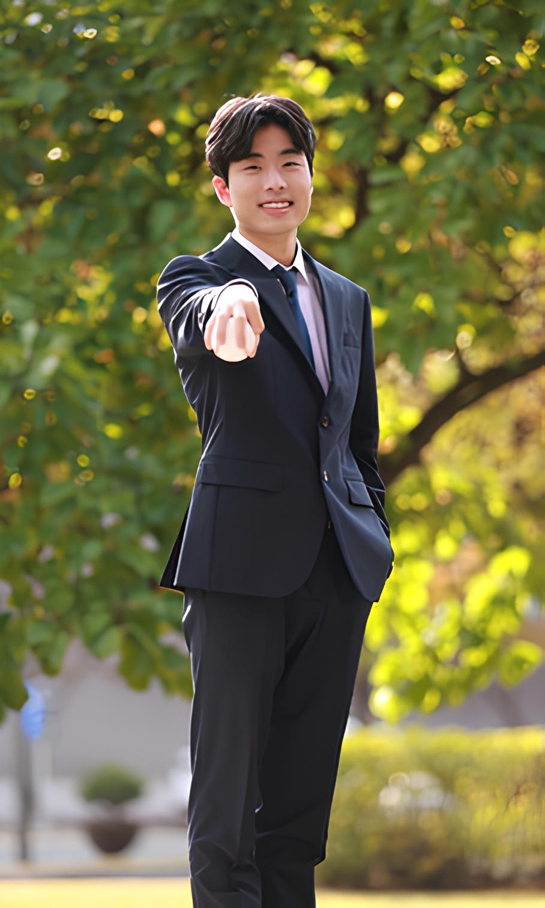

Ph.D. Candidate

School of Electrical Engineering and Computer Science, Korea Advanced Institute of Science and Technology (KAIST)

<a href="https://scholar.google.com/citations?user=RF7LBfEAAAAJ&hl=ko">Google Scholar</a>
<a href="https://github.com/shnam2222">GitHub</a>
<a href="https://orcid.org/0009-0003-4884-3621">ORCID</a>

<h1>Sunghyun (Felix) Nam</h1>

I'm a Ph.D. candidate in the research group of [Prof. Min Seok Jang](https://janglab.org/) at KAIST's School of Electrical Engineering. My research focuses on understanding and designing nanophotonic systems, with a particular interest in resonant metasurfaces and their underlying physics.

My name is 남성현 in Korean, and I go by Felix in English, which is also my [Catholic baptismal name](https://en.wikipedia.org/wiki/Felix_of_Cantalice). <strong>I am currently in Boston, MA, visiting the [Kiyoul Yang Research Group](https://sites.google.com/g.harvard.edu/y-lab/team?authuser=0) of Harvard University.</strong> 

<h2>Research</h2>

My primary research interests lie in the **theoretical and computational analysis and design of nanophotonic devices**, with a particular focus on metasurfaces. I am especially interested in understanding the physical mechanisms that govern their optical response and using this understanding to guide the design of new photonic functionalities.

My research interests include, but are not limited to:

- **Design and physical interpretation of resonant metasurfaces**, with an emphasis on modal analysis and forward design using temporal coupled-mode theory and quasinormal-mode theory.

- **Computational simulation and inverse design of metasurfaces**, using numerical methods such as RCWA, FEM, and FDTD together with optimization techniques including gradient-based and adjoint methods

- **Machine-learning-assisted nanophotonics**, particularly the use of machine learning for electromagnetic surrogate modeling, accelerated simulation, and photonic device optimization.

<h2>Academic Background</h2>

<ul>
  <li>
    <strong>B.S. in Physics, KAIST</strong> 
    Dual degree in Electrical Engineering, Magna Cum Laude 
    March 2017 – February 2024
  </li>

  <li>
    <strong>M.S. in Electrical Engineering, KAIST</strong> 
    March 2024 – February 2026
  </li>
  
  <li>
    <strong>Ph.D. in Electrical Engineering, KAIST</strong> 
    March 2026 – Present
  </li>
</ul>

<h2>Experience</h2>

<ul>
  <li>
    <strong>Research Intern, Jang Research Group</strong> 
    June 2020 – July 2021
  </li>

  <li>
    <strong>KATUSA, Republic of Korea Army</strong> 
    Military Service 
    November 2021 – May 2023
  </li>

  <li>
    <strong>Visiting Scholar, Harvard John A. Paulson School of Engineering and Applied Sciences</strong> 
    [Kiyoul Yang Research Group](https://sites.google.com/g.harvard.edu/y-lab/team?authuser=0) 
    July 2026 – December 2026
  </li>
</ul>

<h2>Beyond Research</h2>

Beyond spending my entire life in the lab, I am a veteran shortstop for the KAIST baseball team, a beginner sabre fencer, and a very shit golfer. I am also a avid fan of the Seoul LG Twins baseball team, Royal Blood, and Tchaikovsky.

