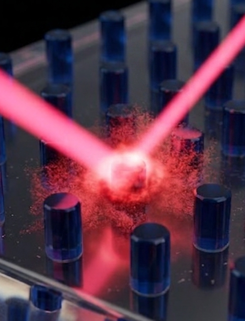

<h1>
Exploring the interaction between light and matter
</h1>

I am a Ph.D. student in Korea studying nanophotonics, a field that explores how light interacts with matter at sub-wavelength scales. This blog is a record of my journey through that field: **what I learn, what confuses me, and how my understanding develops over time**. The notes are built upon my understandings, with the assistance of research papers, lecture materials, textbooks, discussions, and of course, generative AI. My hope is that documenting the process of learning nanophotonics will be useful not only to me, but also to others exploring the same questions.

  

  <small class="image-credit">Image generated with Nano Banana.</small>
  

## Topics

<a href="foundations/">
01 / FOUNDATIONS
<h3>Foundations</h3>

Electromagnetism, polarization, waveguides, and the fundamental tools of photonics.

</a>

<a href="resonances/">
02 / RESONANCES
<h3>Optical Resonances</h3>

Guided-mode resonances, plasmons, coupled-mode theory, QNMs, BICs, and more.

</a>

<a href="metasurfaces/">
03 / METASURFACES
<h3>Metasurfaces</h3>

Huygens metasurfaces, geometric phase, resonant structures, and active control.

</a>

<a href="computational/">
04 / COMPUTATIONAL
<h3>Computational & AI Photonics</h3>

Numerical simulation, inverse design, optimization, and machine learning.

</a>

<a href="research/">
05 / RESEARCH
<h3>My Research</h3>

Research projects, technical notes, simulations, and ongoing ideas.

</a>

<a href="special-topics/">
06 / SPECIAL TOPICS
<h3>Special Topics</h3>

Guest contributions, research perspectives, and focused topics.

</a>

## Recent Topics

New articles and research notes will appear here.